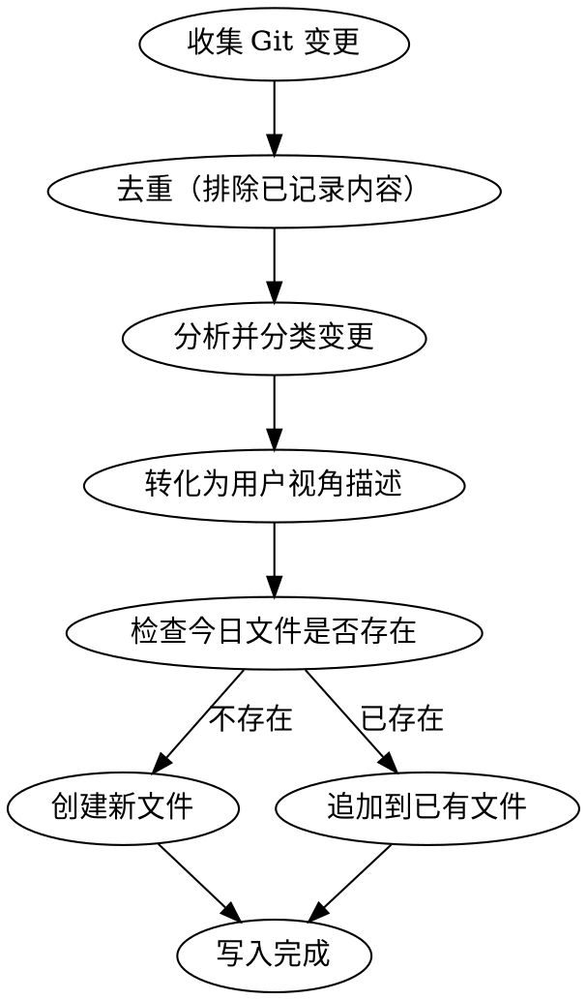

# Work Log Generator

根据当前工作目录的 Git 变更，自动生成或更新 Obsidian 工作日志。

## 流程



## 第一步：收集变更

按顺序执行以下命令，收集所有相关变更：

1. `git log --oneline --since="today"` — 今天的提交
2. `git diff --staged --stat` + `git diff --staged` — 暂存区变更
3. `git diff --stat` + `git diff` — 工作区未暂存变更

如果以上都没有变更，告知用户「当前没有可记录的变更」并停止。

## 第二步：去重

**目标：排除已在近期工作日志中记录过的变更，避免重复。** 使用两层去重机制。

### 2a. 按 commit hash 去重

1. 读取目标目录中最近 5 天的工作日志文件（按文件名中的日期判断）
2. 对每个已存在的日志文件，提取其文件名中的日期 D，执行 `git log --oneline --since="D 00:00:00" --until="D+1 00:00:00"` 获取该日已记录的 commit 列表
3. 从第一步收集到的 commit 中，**排除**已出现在上述列表中的 commit hash
4. 保留未命中任何已有日志的 commit

### 2b. 按内容语义去重（兜底）

1. 读取所有已有日志文件的全部条目内容（`### N.M 标题` 及其下描述）
2. 将第一步收集到的**未暂存/未提交的变更**（这些没有 commit hash，无法通过 2a 去重）逐一与已有条目对比
3. 如果某个变更涉及的文件、功能点与已有条目高度重合（描述同一功能的同一方面），则跳过该变更
4. 判断标准：如果已有「管理后台新增用户导出功能」，新的 diff 只是追加了一个错误处理分支 → 不单独记录，属于同一功能的后续完善

### 2c. 与最接近的前一日日志对比去重

**目标：防止今日条目与前一日日志内容重复。** 这一检查独立于 2a/2b，确保即使 commit hash 不同，语义相同的条目也不会被重复记录。

1. 在目标目录中，找到**日期最接近当前日期但早于当前日期**的日志文件（不要求是紧邻的一天，只要是最接近的那一日即可）
2. 读取该文件的**所有条目标题和描述**
3. 将去重后剩余的所有变更（包括有 commit hash 和无 commit hash 的）逐一与该前一日日志的条目对比
4. 如果某个变更的**核心功能点**与前一日某条目高度重合，则跳过该变更
5. 判断标准（任一满足即视为重复）：
   - 功能标题指代的是同一个功能/模块的同一方面
   - 描述的变更实质是前一日的延续（如前一日记录了「新增 XX 功能」，今日只是补了该功能的一个小边界修复 → 除非修复本身有独立价值，否则不单独记录）
   - 涉及的文件集合高度重合，且改动性质相同（都是新增、都是修复等）
6. **例外**：如果今日变更是前一日的自然演进（如前一日「新增基础功能」，今日「该功能支持了进阶能力」），这**不算重复**，应独立记录

### 去重后无剩余变更

如果去重后没有新变更，告知用户「当前变更已全部记录过，无需重复添加」并停止。

## 第三步：分析并分类

将所有变更归纳为三类：

- **新增**（新增功能、新页面、新能力）
- **优化**（改进现有功能的体验或性能）
- **修复**（修复已知问题或异常行为）

分类依据：
- 新增文件、新路由、新 API → 新增
- 修改已有逻辑、UI 调整、性能提升 → 优化
- 修复 bug、异常处理、边界情况 → 修复

## 第四步：转化为用户视角描述

**这是最关键的一步。** 所有描述必须面向产品/用户，而非开发者。

### 必须遵守

- 用「管理后台新增」「用户侧优化」「修复了XXX问题」等产品语言
- 描述功能带来的**价值和效果**，而非实现方式
- 用一句话概括功能，再用编号列表展开具体能力

### 禁止出现

- 文件名、目录路径
- 函数名、变量名、类名
- 行号、代码片段
- 技术框架名称（React、GORM、Redis 等）
- 技术实现细节（"使用 XX 算法""通过 XX 中间件"）
- commit hash 或 git 相关术语

### 转化示例

| 技术描述 | 工作日志描述 |
|---------|------------|
| 新增 /admin/monitor 路由和页面组件 | 管理后台新增「系统监控」页面 |
| 使用 Redis 计数器统计 QPS | 支持查看平台实时调用情况 |
| models 表新增 sort 字段，GORM AutoMigrate | 优化模型排序能力 |
| 修复 response_time 字段为 null 时图表崩溃 | 修复监控概览展示异常问题 |

## 第五步：确定目标文件

- **目标目录**: `/Users/yuanzi/Obsidian/Yuanzi/飞信云/短信报备平台/`
- **文件名格式**: `{M}月{D}日-工作日志.md`（如 `5月6日-工作日志.md`）
- 使用当前日期生成文件名
- 检查文件是否已存在

### 追加逻辑（文件已存在时）

1. 读取已有文件内容
2. 找到各章节的最大编号（如 `### 1.4`、`### 2.2`、`### 3.3`）
3. 新条目编号续接最大编号（如已有 1.1-1.4，新条目从 1.5 开始）
4. 将新条目追加到对应章节末尾
5. 更新文件顶部的时间戳为当前时间

### 新建逻辑（文件不存在时）

创建新文件，写入完整模板内容。

## 第六步：写入内容

### 完整模板（新建文件时）

```markdown
🕒 更新时间：YYYY-MM-DD HH:MM:SS

## 1. 新增

### 1.1 [功能标题]

[一句话描述，用户视角。]

主要支持：

1. [能力描述1]
2. [能力描述2]

## 2. 优化

### 2.1 [优化标题]

[描述优化了什么，带来什么改善。]

## 3. 修复

### 3.1 [修复标题]

[描述修复了什么问题。]

修复后，[描述修复后的正确行为。]
```

### 格式规范

- 时间戳格式: `YYYY-MM-DD HH:MM:SS`
- 顶级章节: `## N. 类别名`（1. 新增 / 2. 优化 / 3. 修复）
- 子条目: `### N.M 标题`
- 描述列表使用 `1.` `2.` `3.` 编号
- 子条目间不需要空行分隔（参照模板）
- 如果某个类别没有变更，省略整个章节（不写空的章节）
- 修复类条目末尾需要「修复后，[...行为]」描述

### 无变更章节处理

- 如果只有新增和优化，没有修复 → 不写 `## 3. 修复` 章节
- 如果只有修复，没有新增 → 不写 `## 1. 新增` 章节
- 绝不输出空章节

## 第七步：告知用户

写入完成后，输出以下信息：

1. 文件路径
2. 是新建还是追加
3. 记录的条目数量（如「新增 2 项、优化 1 项、修复 1 项」）
