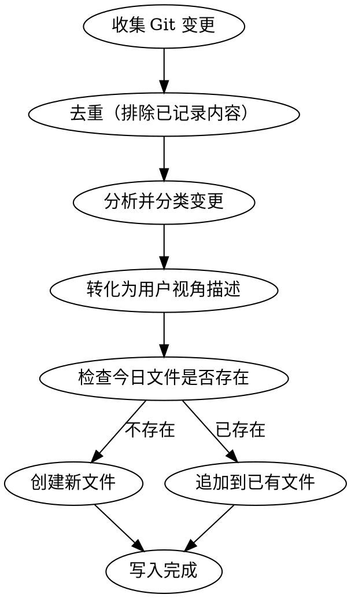

# Work Log Feixinyun

Generate or update an Obsidian work log from the current Git changes for the SMS filing platform project.

## Workflow



## Step 1 Collect Changes

Run these commands in order and collect all relevant changes:

1. `git log --oneline --since="today"` for today's commits
2. `git diff --staged --stat` and `git diff --staged` for staged changes
3. `git diff --stat` and `git diff` for unstaged tracked changes

If there are no changes, tell the user `当前没有可记录的变更` and stop.

## Step 2 Deduplicate

Avoid recording changes that already appear in recent work logs.

### 2a Deduplicate By Commit Hash

1. Read work log files from the last 5 days in the target directory, using the date in each filename.
2. For each existing log file with date `D`, run `git log --oneline --since="D 00:00:00" --until="D+1 00:00:00"` to identify commits for that day.
3. Exclude collected commits whose hashes already appear in those commit lists.
4. Keep only commits not matched by any existing log.

### 2b Deduplicate By Content

1. Read all existing log entries, including every `### N.M 标题` and its description.
2. Compare unstaged and uncommitted changes, which do not have commit hashes, against existing entries.
3. Skip a change if its files and product meaning strongly overlap an existing entry.
4. Treat small follow-up fixes to an already recorded feature as the same entry unless the fix has independent user value.

### 2c Compare With The Closest Previous Log

1. Find the closest existing log date earlier than today in the target directory.
2. Read all titles and descriptions from that previous log.
3. Compare all remaining changes, including committed and uncommitted changes, against the previous log.
4. Skip a change if its core feature point is highly duplicated with a previous entry.
5. Consider a change duplicated if any of these are true:
   - The title refers to the same module and the same aspect.
   - The description is substantially a continuation of the previous entry.
   - The file set overlaps heavily and the change type is the same.
6. Do not skip natural evolution with independent value, such as a feature gaining a clear new capability after a prior basic implementation.

If nothing remains after deduplication, tell the user `当前变更已全部记录过，无需重复添加` and stop.

## Step 3 Categorize

Group remaining changes into these categories:

- **新增**: new features, pages, APIs, or capabilities
- **优化**: improvements to existing behavior, UX, or performance
- **修复**: bug fixes, error handling, and edge cases

Use these rules:

- New files, routes, APIs, or visible capabilities -> 新增
- Existing logic changes, UI polish, or performance improvements -> 优化
- Bug fixes, exception handling, or incorrect behavior corrections -> 修复

## Step 4 Write Product-Language Descriptions

Write all entries for product and user readers, not developers.

Must do:

- Use product wording such as `管理后台新增`, `用户侧优化`, and `修复了 XXX 问题`.
- Describe value and effect, not implementation.
- Summarize each feature in one sentence, then expand with numbered capabilities when useful.

Do not include:

- File names or directory paths
- Function, variable, or class names
- Line numbers or code snippets
- Framework names
- Technical implementation details
- Commit hashes or Git terminology

Examples:

| Technical description | Work log description |
| --- | --- |
| 新增 `/admin/monitor` 路由和页面组件 | 管理后台新增「系统监控」页面 |
| 使用 Redis 计数器统计 QPS | 支持查看平台实时调用情况 |
| 模型表新增排序字段 | 优化模型排序能力 |
| 修复响应时间为空时图表崩溃 | 修复监控概览展示异常问题 |

## Step 5 Determine Target File

- Target directory: `/Users/yuanzi/Obsidian/Yuanzi/飞信云/短信报备平台/`
- Filename format: `{M}月{D}日-工作日志.md`, for example `5月6日-工作日志.md`
- Use the current date in the local timezone.
- Check whether the target file already exists.

### Append When The File Exists

1. Read the existing file.
2. Find the largest entry number in each section, such as `### 1.4`, `### 2.2`, or `### 3.3`.
3. Continue numbering from the largest number in the matching section.
4. Append new entries to the end of their matching section.
5. Update the top timestamp to the current time.

### Create When The File Does Not Exist

Create the file and write the full template with only the sections that have entries.

## Step 6 Write Content

Use this template for new files:

```markdown
🕒 更新时间：YYYY-MM-DD HH:MM:SS

## 1. 新增

### 1.1 [功能标题]

[一句话描述，用户视角。]

主要支持：

1. [能力描述1]
2. [能力描述2]

## 2. 优化

### 2.1 [优化标题]

[描述优化了什么，带来什么改善。]

## 3. 修复

### 3.1 [修复标题]

[描述修复了什么问题。]

修复后，[描述修复后的正确行为。]
```

Formatting rules:

- Timestamp format: `YYYY-MM-DD HH:MM:SS`
- Top-level sections: `## N. 类别名`, where categories are `1. 新增`, `2. 优化`, and `3. 修复`
- Entries: `### N.M 标题`
- Use numbered lists with `1.`, `2.`, `3.`
- Do not add empty sections.
- If there are only 新增 and 优化 entries, omit `## 3. 修复`.
- If there are only 修复 entries, omit `## 1. 新增`.
- End each 修复 entry with `修复后，[...行为]`.

## Step 7 Report Result

After writing the log, tell the user:

1. The file path
2. Whether the file was created or appended
3. The number of recorded entries, such as `新增 2 项、优化 1 项、修复 1 项`
